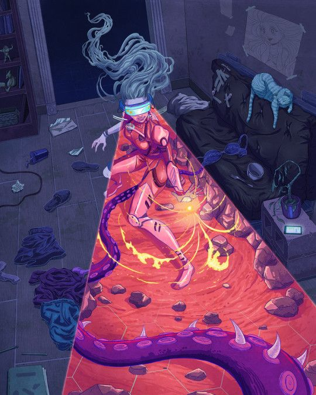
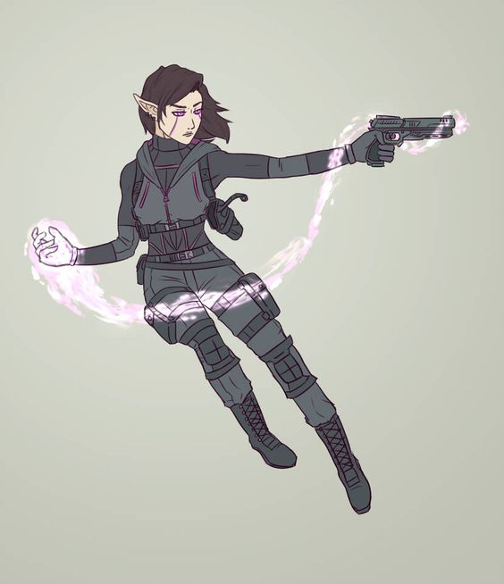

<h1> O que é Shadowrun? </h1>
<h2> Cyberpunk: capitalismo </h2>
> O que significa que o resto de nós enfrentam uma dura decisão: Aturar essa merda toda. Ou não. Existem várias formas de se vender nesse mundo e achar um mestre corporativo que vai mandar em você. Alguém tem que coletar o lixo, varrer o chão, fazer a contabilidade. As megas têm montanhas literais de trabalho doméstico que são realizados numa série infinita de expedientes de doze
ou dezesseis horas

Grandes corporações crescem cada dia mais, explorando uma mão de obra desesperada e levando cada recurso do planeta no processo. O neoliberalismo venceu, e você perdeu. Agora resta abaixar a cabeça para os trilionários do mundo, para as corporações, para o dinheiro.

<i>"Neoliberal governmentality has utilized alternative modes of killing that have supplemented more traditional forms of human destruction such as state racism, spectacular killing, and the suspension of the law. As a way to eliminate surplus bodies that fail to function in the production of value, neoliberal governmentality has developed subtle ways of killing its subjects that often function as letting them die" [9780367490997] </i>

{: width="75%"}

 

<h2> Cyberpunk: pós-humanismo </h2>
> Nós demoramos até o início deste século para descobrir que não deveríamos tentar superar as máquinas, e sim nos juntar a elas. É claro que tudo começou com as próteses: pernas e mãos artificiais que se moviam como as originais, olhos e orelhas cibernéticas que permitiam aos cegos e surdos congênitos ver e ouvir. Mas pouco tempo depois, as pessoas descobriram que o que começou como maravilhas médicas poderiam ser adaptadas para aprimorar sentidos e habilidades de qualquer um. [...] Você pode colocar placas de armadura na sua pele, ou entrelaçar seus ossos com metal para que seus punhos e pernas deem golpes destruidores. Você pode tornar seus sentidos mais aguçados, seu cérebro mais rápido [...] Mas nada disso é de graça. E eu não falo só de dinheiro, mas de um custo maior. Todas essas paradas são úteis e legais, mas são artificiais. Não é meta-humano, e o seu corpo sabe disso. Cada vez que ganha uma dessas ampliações, você abandona uma parte de si mesmo

Com o avanço tecnológico constante, novas formas de autoaprimoramento foram criadas, e com elas as barreiras morais para a junção humano-máquina se perderam. Mas será que é só uma questão moral? Verás que trocar o corpo com que nasceste tem um custo pra sua alma...

 

<h2> Cyberpunk: a Matriz </h2>
> Com a RA, a Matriz está sempre ao seu redor. Basta ter o equipamento certo para receber mensagens flutuantes dos seus amigos bem na sua frente, acompanhando seu movimento. Ao passar por lojas, você recebe ofertas atuais, personalizadas pras suas preferências baseadas no que você já comprou. Amostras de vídeo e música estão por todos os lugares, só esperando você abri-las com um gesto e ver se há algo que curte. Como essas músicas e filmes combinam com o seu gosto e como você as encontra? É a magia do controle corporativo

Sim, o Mark Zuckemberg conseguiu, a realidade virtual é uma realidade, e tu não só pode, mas irá precisar dela. Seja para hackear um computador, para proteger seus arquivos ou mesmo para comprar uma bazuca.

 

<h1> O maior diferencial de Shadowrun: A magia </h1>
> Os conjuradores ainda são uma minoria significativa da população, mas a magia teve um efeito profundo na forma do mundo. Da existência de departamentos mágicos nas maiores corps do mundo até caçadas através do globo em busca de reagentes mágicos raros, de magias sendo lançadas na briga urbana até a pesquisa sendo realizada nos maiores salões do conhecimento, a magia está presente em todas as partes da sociedade do Sexto Mundo.

O que diferencia o sexto mundo é que houve um novo despertar, isto é, a magia ressurgiu na terra, afetando tudo a sua volta. Fazendo com que algumas pessoas nascessem com genes meta-humanos (elfos, orks, trolls e anões). Além disso, muitas pessoas desenvolveram capacidades mágicas, sim, você pode ser um mago e lutar contra um cara com metralhadora.

<h1> Recomendação de conteúdo para ficar interessado em Shadowrun </h1>
<h2> Vídeos no Youtube </h2>
<h3 > Sobre o que é Cyberpunk </h3>
[Uma análise da origem do Cyberpunk (com base em literatura e filmes)](https://www.youtube.com/watch?v=kNZDVxcyfBw){:target="_blank"}

<h3 > Sobre Shadowrun </h3>
[Uma apresentação INCRÍVEL de Shadowrun](https://youtu.be/9jgif4acDVc?t=20){:target="_blank"}

<h2> Filmes! =D </h2>
[Akira](https://en.wikipedia.org/wiki/Akira_(1988_film)){:target="_blank"}

[Ghost in the Shell](https://en.wikipedia.org/wiki/Ghost_in_the_Shell_(1995_film)){:target="_blank"}
